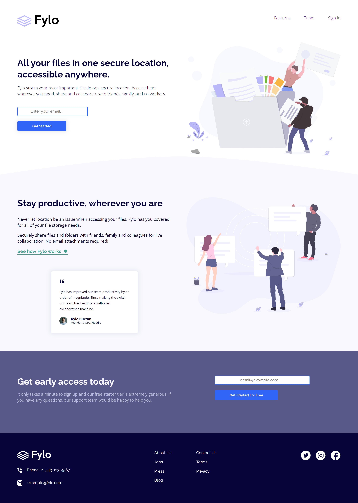

# Frontend Mentor - Fylo landing page with two column layout solution

This is a solution to the [Fylo landing page with two column layout challenge on Frontend Mentor](https://www.frontendmentor.io/challenges/fylo-landing-page-with-two-column-layout-5ca5ef041e82137ec91a50f5). Frontend Mentor challenges help you improve your coding skills by building realistic projects. 

## Table of contents

- [Overview](#overview)
  - [The challenge](#the-challenge)
  - [Screenshot](#screenshot)
  - [Links](#links)
- [My process](#my-process)
  - [Built with](#built-with)
  - [What I learned](#what-i-learned)
  - [Useful resources](#useful-resources)
- [Author](#author)

### Screenshot

### Links

- Solution URL: [Frontend Mentor Solution](https://www.frontendmentor.io/solutions/fylo-landing-page-with-two-column-layout-qh7A0Tl8IP)
- Live Site URL: [Live Site at Vercel](https://fylo-landing-page-with-two-column-layout-six.vercel.app/)
## My process

### Built with

- Semantic HTML5 markup
- Flexbox
- Grid
- Responsive Design
- CSS Animations
- Media queries

### What I learned

To build faster a Landing Page and create containers

### Useful resources

## Author

- Github - [correlucas](https://github.com/correlucas/)
- Frontend Mentor - [@correlucas](https://www.frontendmentor.io/profile/correlucas)
